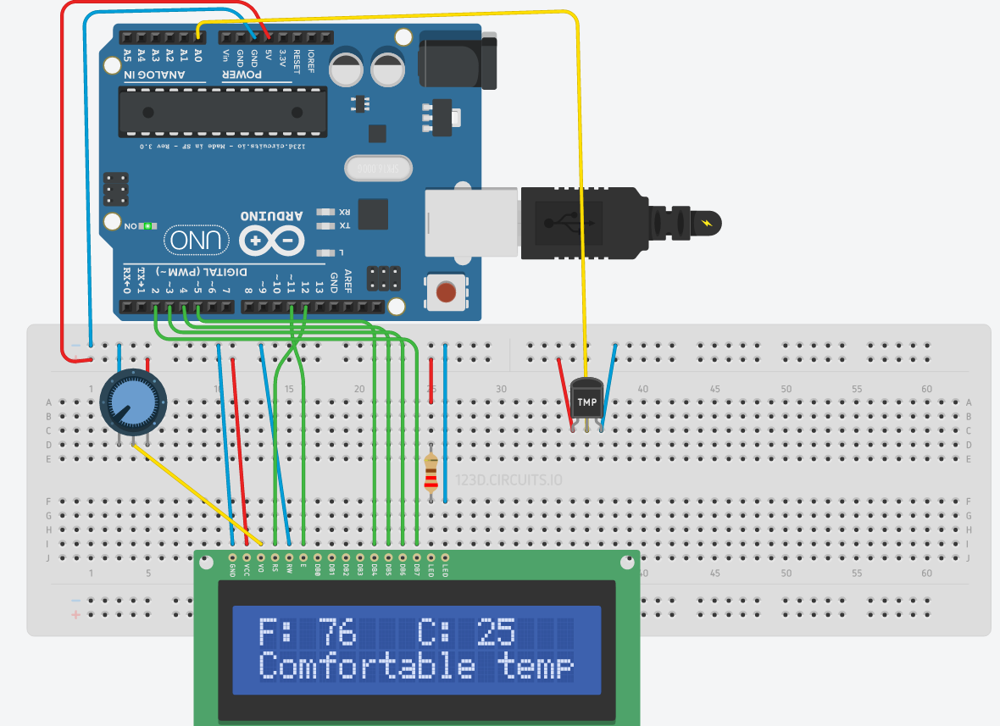

=====
Team Bravo: Group Project 2
=====

**Group Members:** *Angelo Renteria, Colby Tang, Colton Eastland*

**Equipment:**

- Arduino Uno
- Breadboard
- 10k Potentiometer
- 16x2 LCD Screen
- Temperature Sensor

**Objective:**

Our objective was to use an Arduino Uno to read the temperature of the room using a TMP36 sensor and output to an LCD display using AVR C and AVR Assembly. We did not achieve this goal. Our issue was getting the temperature sensor to properly input into the Arduino Uno. We believe that we needed an Analog-to-Digital Converter for this.

**Directory Notes:**

- attempts *(failed attempts, backups)*

  - lcdlibrary *(tried to import C lcd library)*
  - tempLCD *(attempt at using C calling assembly)* 
- avr      *(main folder)*

  - extra *(extraneous files for failed attempt)*
  - include *(Makefile files)*
  - main *(main directory for program)*
  
    - assembly_attempt *(attempt starting from assembly)*
    - mainCpp *(Cpp file that we tried to achieve)*

=====
Circuit Diagram
=====

